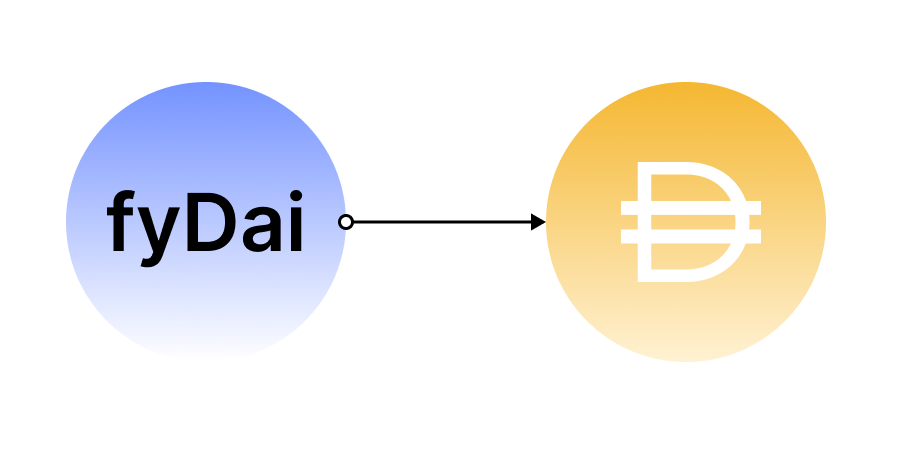

# Introduction

Yield brings fixed-term, fixed-rate borrowing and lending to decentralized finance.

Today most of the popular decentralized finance protocols are floating-rate. While floating-rate lending and borrowing is a powerful tool, it comes with significant drawbacks. These protocols may experience interest rate volatility that can make it difficult for you to plan for the future, make investment decisions, and properly hedge risk when borrowing and lending. Decentralized finance has several use cases that can be greatly improved with fixed-rate, fixed-term borrowing and lending.

<!-- TODO: maybe we can create a blog post outlining use cases and link it here - Sanket -->

To enable fixed-rate, fixed-term borrowing and lending, Yield uses a class of tokens called *fyTokens(fixed yield tokens)*. fyTokens are Ethereum based ERC-20 tokens that can be redeemed for an underlying asset one-to-one after a predetermined maturity date. For example, if you have one fyDai token, you can redeem it for one Dai after the maturity date.

<figure class="image" align = "center">
  
</figure>

fyTokens are analogous to zero-coupon bonds in the sense that they do not pay interest but instead trade at a discount, rendering a profit at maturity when it is redeemed for its full face value. The interest rate is calculated by the difference between the discounted value and the underlying asset's value at maturity.
