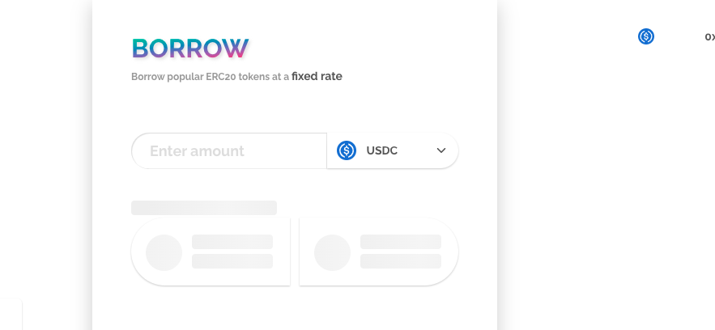
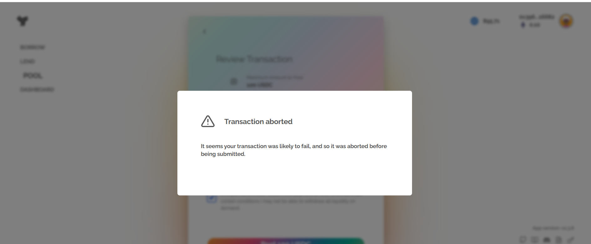
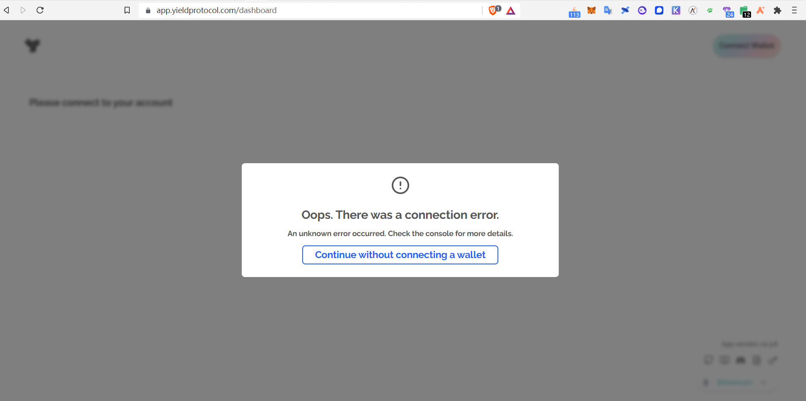
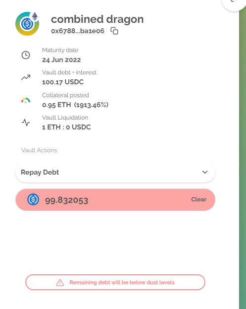

# 疑难解答

## General(一般错误)

 - 重置应用程序（单击您的右上角个人头像 > 故障排除 > “重置应用程序”）

## Not Loading(页面未加载)

<figure class="image" align = "center">
  
</figure>

 - 重置应用程序（单击您的右上角个人头像 > 故障排除 > “重置应用程序”）

## Transaction Aborted(交易中止)

<figure class="image" align = "center">
  
</figure>

 - 进入设置（单击右上角个人头像）并选择“使用交易批准”选项

## Connection Error（连接错误）

<figure class="image" align = "center">
  
</figure>

 - 确保你连接到受支持的网络（ETH主网/Arbitrum）.
 - 如果您使用的非MetaMask的钱包（或者您使用的是ledger），请使用 WalletConnect 连接。.

## Remaining Debt will be Below Dust Levels（剩余债务将低于尘埃水平）

在撰写本文时，金库中允许的最低债务为 5000 美元等值（ETH主网）或 100 美元等值（Arbitrum）。如果您试图偿还的金额会使您的剩余债务低于该水平，那么将会导致此错误。

<figure class="image" align = "center">
  
</figure>

 - 保证剩余债务高于该水平或者一次性还清债务
 - 尝试将还款数额增加等值的1USDC/1DAI
 - 确保你的账户中有足够还清债务的的资金

## Liquidated（清算）

我们通过在 Discord 上授予他们“协议英雄”角色来识别已被清算的用户。

如果您已被清算，我们需要验证您是否拥有清算保险库：
 - 打开https://www.myetherwallet.com/wallet/sign
 - 连接拥有清算保险库的钱包
 - 签署包含任何文本的消息
 - 在我们的Discord中打开一张票，将结果发布到该频道。

## Maybe It's a Bug（其他Bug）

如果存在与您发现的问题相匹配的问题，请检查 [bug tracker](https://github.com/yieldprotocol/bugs/issues). 如果有，您可以考虑等待，或者尝试 [轻推我们](https://discord.com/channels/752978124614008945/764135581704781864) so that we prioritize it.

 ## If Everything Else Fails（如果一切都失败了）

 如果您无法按照此处的说明解决您的问题，请在我们的 Discord中开一张票 [#create-ticket](https://discord.com/channels/752978124614008945/893209711397195776). 出于安全原因，我们无法在公共渠道上提供支持。
 - 告诉我们你想要达到的目标是什么。
 - 告诉我们你是如何解决这个问题的。
 - 告诉我们你的地址。
 - 如果有任何调试信息（一长串无意义的十六进制数据），请将其复制并粘贴到频道中。
 - 请注意，某些级别的支持仅在欧洲或美国工作时间提供。
[Edit this page](https://github.com/yieldprotocol/docs-v2/edit/main/troubleshooting_cn.md)
